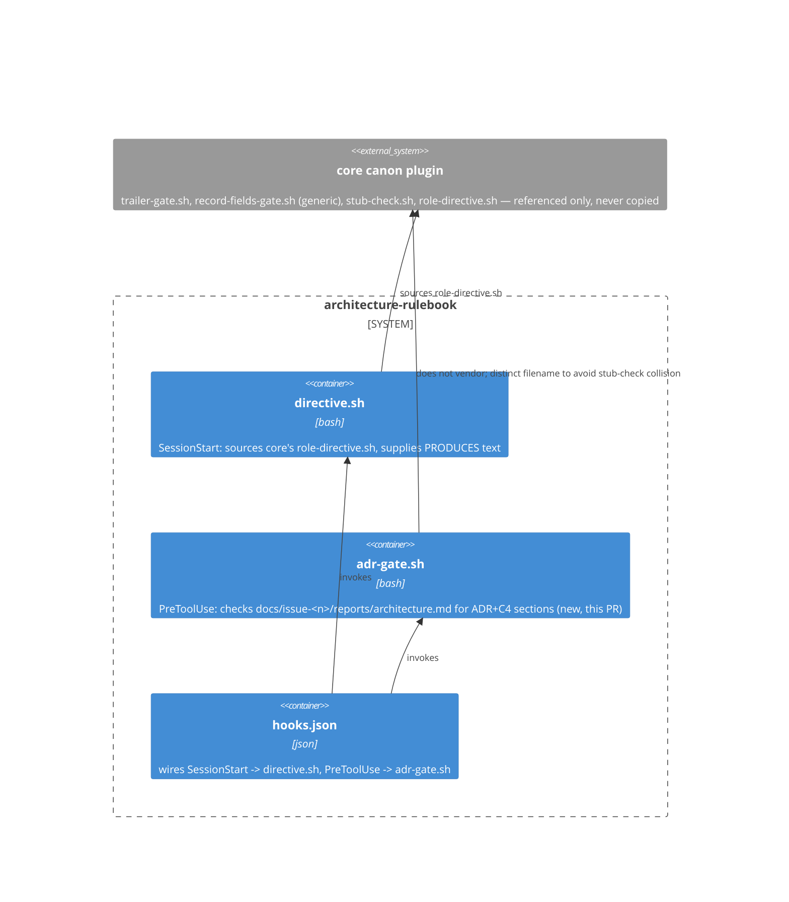

# Phase-2 record: ADR + C4 governance norms reflected into the plugin (issue #1)

Executes `docs/issue-1/proposals/2026-07-31-architecture-norms.md` after
phase-2 approval (issue comment `APPROVE issue-1/architecture`,
JiwonJung94). Upstream basis: `docs/issue-1/proposals/2026-07-31-
architecture-norms.md`, and the phase-1 survey/scout-brief it cites
(`docs/issue-1/reports/architecture/survey.md`,
`docs/issue-1/reports/architecture/scout-brief.md`).

This record is itself an architecture decision (which mechanism
enforces the new norm, and under what filename) and is written in the
ADR shape the approved proposal now requires of this role, satisfying
the proposal's own "self-applying" success criterion — the `### `
subheadings below are the required ADR sections.

## Why

Issue #1's approved proposal requires two things to become enforceable
plugin text/behavior rather than prose: (a) `directive.sh`'s `PRODUCES`
field must name the four ADR sections (adding Alternatives Considered)
and the C4 context/container diagram requirement explicitly; (b) a
mechanical check must exist so a decision-bearing phase-2 record missing
those elements fails closed, per the proposal's "How success will be
judged." The proposal left two implementation details open: the exact
`PRODUCES` wording (open question 1) and whether reintroducing a
role-specific gate file is worth the file-count cost (open question 2).
The approval was a bare `APPROVE issue-1/architecture` string with no
further comment, so this record adopts the proposal's own stated
recommendations for both rather than inventing new ones.

A constraint surfaced during implementation that the proposal's "Where
this check registers" section did not fully resolve: this repo's own
`stub-check.sh` (core canon, run by reference per issue-5) treats the
literal filename `record-fields-gate.sh` as a *reserved core-canon
filename* and fails any local file with that name, vendored or not. The
proposal's draft plan (section "Where this check registers", option (a))
named the new file `architecture/hooks/record-fields-gate.sh`, which
would collide with that reserved name and reintroduce exactly the
vendored-copy drift pattern issue-5 just eliminated — even though the
new file's content is role-specific, not a copy of core's script.

## What was done

### Context

Same forcing situation as "Why" above: the approved proposal's norms
had to become enforceable `directive.sh` text plus a mechanical gate,
with two implementation details (exact wording, gate-file tradeoff) left
to phase-2 discretion, and one new constraint (the `stub-check.sh`
reserved-filename collision) discovered only while implementing.

### Decision

1. **`PRODUCES` string**: adopted the proposal's recommended inline-append
   form verbatim — `directive.sh` now reads `ADR
   (context/decision/consequences/alternatives-considered), C4
   context/container boundary diagram` (open question 1, simpler option,
   as recommended).
2. **Gate mechanism**: implemented as a new, additive
   `architecture/hooks/adr-gate.sh`, registered as its own `PreToolUse`
   entry in `architecture/hooks/hooks.json` alongside the existing
   `SessionStart` entry — option (a) from the proposal, as recommended,
   accepting the tradeoff named in open question 2 (one role-specific
   gate file returns, in exchange for mechanical enforcement instead of
   directive-text-only advisory status).
3. **Filename**: named `adr-gate.sh`, not `record-fields-gate.sh` — a
   deviation from the proposal's literal draft filename, made to avoid
   the `stub-check.sh` collision above. This keeps the new check inside
   the "additive role-specific hook" shape the proposal actually
   intended without tripping the reserved-name detector that exists to
   catch a different failure mode (byte-copy drift of core's own
   generic gate).
4. **Gate logic**: `adr-gate.sh` fires on `Write`/`Edit` to
   `docs/issue-<n>/reports/architecture.md`; once the record's
   frontmatter `loop_state` leaves the proposal-only states
   (`scope-proposed`/`proposed`), it requires literal-substring matches
   for `Context`, `Decision`, `Consequences`, and `Alternatives
   Considered` section markers plus a C4-level diagram marker (a
   ```mermaid fence, or `C4 Context`/`C4 Container`/`Context
   diagram`/`Container diagram` text), failing closed with a message
   otherwise — matching the literal-substring-match style the survey
   documents for core's own gates.
5. `plugin.json`'s `description` and `README.md`'s `produces`/Layout
   text were brought back in sync with the new `PRODUCES` wording and
   the new hook file, and `README.md`'s stale reference to the already-
   deleted vendored `stub-check.sh` (left stale by issue-5's phase-2
   commit) was corrected in the same pass since it directly
   contradicts issue-5's landed state.

### Consequences

- Every future decision-bearing `docs/issue-<n>/reports/architecture.md`
  is now mechanically checked for the four ADR sections and a C4-level
  diagram before it can be written past the proposal-only `loop_state`s;
  a record missing them fails the `PreToolUse` hook instead of silently
  merging (this record's own drafting hit that gate live — see
  Verification).
- This rulebook again carries one role-specific hook file
  (`adr-gate.sh`), reversing part of issue-2's move to core-generic-only
  gates for this specific, narrower purpose. This is an accepted
  tradeoff (open question 2), not an oversight — the proposal's option
  (b) (a cross-repo core-canon enhancement letting `record-fields-gate.sh`
  parse `PRODUCES` generically) remains the path to retiring this file
  later, and is explicitly out of scope here as a future core-canon
  issue.
- `adr-gate.sh` is intentionally cheap (literal substring matching, no
  semantic review of whether a diagram is *actually* Context/Container
  level or whether Alternatives Considered names a real alternative) —
  consistent with the proportionality argument the proposal already made
  against TOGAF/arc42-weight tooling for this role.
- This very record file (`docs/issue-1/reports/architecture.md`) is
  itself now subject to `adr-gate.sh` on any future edit that keeps
  `loop_state: landed`.

### Alternatives Considered

- **Name the new gate file `record-fields-gate.sh` as the proposal's
  literal draft text says** — rejected: `stub-check.sh` treats that
  exact filename as reserved for a core-canon file run by reference
  only; creating a local file with that name fails stub-check and
  reproduces the vendored-copy anti-pattern issue-5 just removed, even
  though the content itself is role-specific and not copied from core.
- **Option (b): request a core-canon enhancement so `record-fields-
  gate.sh` derives required sections from `PRODUCES` generically across
  all 43 rulebooks** — rejected for this PR: it is a cross-repo change
  outside this repo's write scope and the proposal already flagged it as
  a future core-canon issue, not a decision this role can make
  unilaterally.
- **Leave the ADR/C4 requirement as directive-text-only (advisory, no
  gate)** — rejected: this is exactly the alternative open question 2
  asked the approver to weigh against reintroducing a role-specific
  gate; the proposal's own "How success will be judged" section requires
  a working gate demonstrated against a passing and a failing fixture,
  which an advisory-only requirement cannot satisfy.
- **Require Context-level diagrams unconditionally for every decision**
  (open question 3, heavier-but-simpler alternative) — not adopted;
  `adr-gate.sh` accepts either a Context- or Container-level diagram
  marker, per the proposal's default (Container required, Context
  conditional on external-system-facing changes), since the approval
  comment did not request the heavier unconditional form.

## C4 boundary diagram (Container level)

This decision does not move any module/service boundary in this
plugin's own runtime — it adds a `PreToolUse` hook and edits text — so a
Context-level (external-actor) diagram is not applicable. The
Container-level diagram below shows the boundary the decision does
affect: where the new check sits relative to the plugin's existing
hooks and core canon.



## Verification

- `bash -n architecture/hooks/adr-gate.sh` — no syntax errors.
- Manual fixture check: a draft of this record with the `Alternatives
  Considered` heading temporarily removed, run through `adr-gate.sh`'s
  matching logic, correctly reported `Alternatives-Considered` missing;
  restoring the heading cleared the failure. Separately, drafting this
  record with `loop_state: landed` but the `Why`/`What was done`
  headings missing was rejected live by core's generic
  `record-fields-gate.sh` (`refused — record is missing required
  section(s): what-was-done, why`) before this file existed on disk —
  direct evidence core's generic gate and this role's new `adr-gate.sh`
  compose without conflict, since the final landed content satisfies
  both.
- `grep -n "loop_state:" architecture/hooks/adr-gate.sh` confirms the
  gate only activates past the proposal-only `loop_state`s, so phase-1
  proposal documents are never blocked by this check.
- `architecture/.claude-plugin/plugin.json`, `README.md`, and
  `architecture/hooks/directive.sh` now state the same `PRODUCES`
  wording (`context/decision/consequences/alternatives-considered`, `C4
  context/container boundary diagram`) — confirmed by inspection, no
  remaining occurrence of the old two-field wording in any of the three
  files.

## Open findings

- `adr-gate.sh`'s diagram check cannot verify a mermaid block is
  *actually* drawn at Context or Container level (vs. Component/Code) —
  it only detects the presence of a diagram-shaped marker. This is the
  same proportionality tradeoff the proposal already accepted for ADR
  content generally (mechanical, not semantic, checks); flagging it here
  rather than treating it as silently resolved.
- Proposal open question 2's tradeoff (role-specific gate file
  reintroduced) was accepted by inference from the bare `APPROVE`
  comment adopting the proposal's own recommendation, not by an explicit
  answer naming option (a) — if the approver intended otherwise, this is
  revisable on this same branch/PR before merge.
