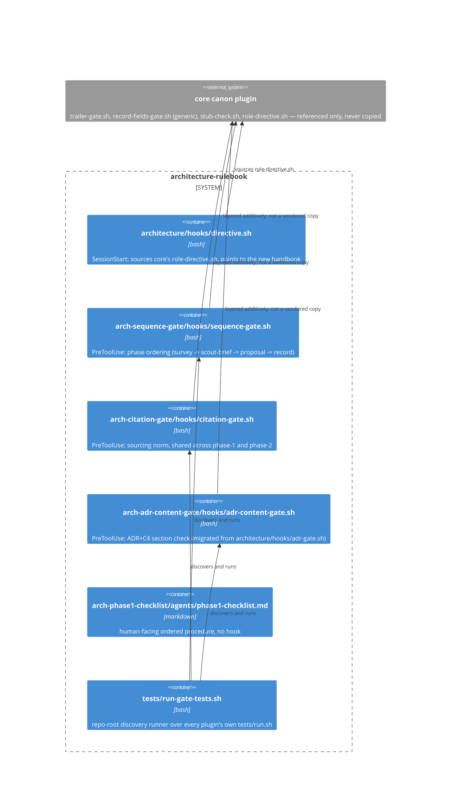

# Phase-2 record: architecture-enforcement plugin set (issue #10)

Executes `docs/issue-10/proposals/2026-07-31-architecture-enforcement.md`
after phase-2 approval (issue comment `APPROVE issue-10/architecture`,
JiwonJung94, single-account mode per `docs/specs/approvers.md`). Upstream
basis: that proposal, and the phase-1 survey/scout-brief it cites
(`docs/issue-10/reports/architecture/survey.md`,
`docs/issue-10/reports/architecture/scout-brief.md`).

## Why

Issue #10's approver correction required this role to stop treating
methodology enforcement as one directive-deepening pass plus one
monolithic gate script, and instead ship it as a **plugin set**: each
adopted methodology element as its own independent, self-contained
plugin (own directive/hooks/tests, own `plugin.json`, own marketplace
entry, own kill switch), with the phase-1 (기획서) and phase-2 (산출물)
norms each expressed as *which plugins combine* rather than as one
script's internal branches. This record is itself an architecture
decision (which plugins exist, what each owns, how they compose) and is
written in the ADR shape the approved proposal requires of this role.

## What was done

### Context

Before this PR, the `architecture` plugin carried one `PreToolUse` gate
(`adr-gate.sh`, phase-2 only) and a one-line directive summary. Nothing
mechanically enforced that phase-1 (survey/scout-brief/proposal) had
happened at all before a phase-2 record could claim `landed`, and no
gate/directive text was split by methodology concern — a single
`adr-gate.sh` had grown to be architecture's only enforcement surface.

### Decision

Implemented exactly the four plugins the approved proposal's §0
specifies, as sibling directories in this repo with a shared root
`.claude-plugin/marketplace.json`:

1. **`arch-sequence-gate/`** — owns phase ordering only. Its
   `hooks/sequence-gate.sh` fires on `Write|Edit|MultiEdit` to
   `docs/issue-<n>/proposals/*.md` (requires `survey.md` to already
   exist) and to `docs/issue-<n>/reports/architecture.md` (requires
   both `survey.md` and `scout-brief.md` — or an explicit skip-
   justification phrase in the issue's proposal — once the resulting
   `loop_state` leaves `scope-proposed`/`proposed`). Existence-only,
   resulting-content computed for all three tool kinds, fails closed
   when it cannot be determined. Kill switch `ARCH_SEQUENCE_GATE_OFF=1`.
2. **`arch-citation-gate/`** — owns the sourcing norm only, shared
   unchanged across both phases (one script, two globs, per the
   proposal's combination table, not two implementations). Fires on
   `docs/issue-<n>/proposals/*.md` and `docs/issue-<n>/reports/
   architecture.md`; denies when the resulting content contains
   external-knowledge phrasing with no URL and no `Sources:` entry.
   Kill switch `ARCH_CITATION_GATE_OFF=1`.
3. **`arch-adr-content-gate/`** — owns the ADR+C4 required-section norm
   for the phase-2 record. Migrated from `architecture/hooks/
   adr-gate.sh` (issue-1) into its own plugin directory; the migration
   closes the `MultiEdit` resulting-content gap the phase-1 survey
   flagged — an unresolvable `MultiEdit` now fails closed instead of
   passing the write through unchecked. Kill switch
   `ARCH_ADR_CONTENT_GATE_OFF=1`, with `ARCHITECTURE_ADR_GATE_OFF=1`
   honored as a deprecated alias for one release (this repo's own
   no-silent-break precedent).
4. **`arch-phase1-checklist/`** — owns the repeated survey -> scout-
   brief -> proposal procedure as a checklist artifact
   (`agents/phase1-checklist.md`), not a gate or tool-use subagent —
   matching the proportionality call the phase-1 proposal already made
   against TOGAF/arc42-weight tooling.

Each plugin ships its own `hooks/hooks.json` (where it has a hook), its
own `tests/fixtures/**` plus a `tests/run.sh` driver, and its own
`README.md` stating the single methodology it owns, at the completeness
level `freelunch`/`scout` demonstrate. `tests/run-gate-tests.sh` (repo
root) discovers and runs every plugin's `tests/run.sh` — one command
that runs everything, embedding no plugin's check logic itself.

`architecture/hooks/hooks.json` now carries only its `SessionStart`
wiring; the `PreToolUse` entry for the removed `adr-gate.sh` is gone.
`architecture/hooks/directive.sh`'s `PRODUCES` text gained one clause
pointing at the new `docs/handbooks/architecture-methodology.md` (the
deepened phase-1/phase-2 stage/judgment-criteria/prohibition text) and
at `arch-phase1-checklist`. `README.md` documents the four new plugins
and their install lines.

### Consequences

- Every future `docs/issue-<n>/proposals/*.md` and `docs/issue-<n>/
  reports/architecture.md` write is now checked by three independently
  testable, independently disableable gates instead of one; a reviewer
  can answer "which plugin enforces X" by reading a single plugin's
  `README.md`, without opening `architecture`'s directive text.
- The `MultiEdit` gap in the old `adr-gate.sh` is closed for its
  successor plugin; any resulting-content computation this proposal's
  three gates cannot resolve now denies instead of silently passing.
- Four `plugin.json`s and four marketplace entries exist where one gate
  file used to — the proposal's own accepted cost, in exchange for
  per-methodology legibility (the approver's stated rationale).
- `architecture`'s plugin now owns only role-boundary/directive
  concerns; all phase-1/phase-2 content and ordering enforcement lives
  in the four `arch-*` plugins, matching the correction's requested
  shape.

### Alternatives Considered

- **Keep one monolithic `phase1-gate.sh`** (the prior revision's
  design) — rejected: this is exactly what the approver's correction
  asked to move away from; a single script hides which methodology owns
  which branch.
- **Fold the four plugins into the existing `architecture` plugin as
  extra hook entries instead of separate directories** — rejected: the
  correction explicitly requires each plugin to be independently
  packaged, versioned, and marketplace-registered, matching
  `freelunch`/`scout`'s shape rather than this repo's own
  everything-in-one-role-plugin shape.
- **Give each of the four plugins its own git remote/repo** (open
  question 4) — not adopted; kept as four sibling directories with one
  shared root `marketplace.json`, per the proposal's own recommendation,
  since none of the four has a use case outside this rulebook.
- **Two separate citation-check scripts, one per phase** (open question
  5) — not adopted; one shared `citation-gate.sh` matched against both
  globs in its own `hooks.json`, per the proposal's recommendation, to
  avoid duplicating the sourcing-check logic.
- **Content-validate survey/scout-brief, not just check existence**
  (open question 1) — not adopted for this PR; existence-only, per the
  proposal's recommendation, to keep phase 2's scope bounded. Recorded
  as an open finding below.
- **Fixed skip-justification phrase list vs. human-review-only for the
  scout-brief skip path** (open question 2) — adopted the fixed
  phrase-list approach, per the proposal's recommendation, for
  consistency with this repo's existing literal-substring gate style;
  flagged as the weakest-verified part of the design (open finding
  below).

## C4 boundary diagram (Container level)

This decision does not move any module/service boundary in this
plugin's own runtime — it adds three new `PreToolUse`-bearing plugins
and one documentation-only plugin, and removes one hook entry from
`architecture`. The Container-level diagram below shows the boundary the
decision affects: where each new plugin's gate sits relative to the
existing `architecture` plugin and core canon.

## Verification

- `bash tests/run-gate-tests.sh` — all three gate-bearing plugins' fixture
  suites pass: `arch-sequence-gate` (4/4: pass-full-sequence,
  fail-missing-survey, fail-missing-scout-brief-no-skip-note,
  pass-scout-skip-justified), `arch-citation-gate` (2/2: pass-sourced,
  fail-unsourced-claim), `arch-adr-content-gate` (3/3: pass-all-sections,
  fail-missing-alternatives, fail-multiedit-unresolvable).
- `python3 -m json.tool` on every new/edited `hooks.json` and
  `plugin.json` and on `.claude-plugin/marketplace.json` — all parse.
- `grep -rn "record-fields-gate.sh\|trailer-gate.sh\|handbook-trigger-gate.sh\|parse-check.sh" arch-*/hooks arch-*/tests architecture` —
  no core-canon script body present anywhere across the four plugins;
  only pointer comments citing the canon location by name.
- `git status` confirms `architecture/hooks/adr-gate.sh` was removed
  (not left as a stale duplicate) once `arch-adr-content-gate/hooks/
  adr-content-gate.sh` existed with the same logic plus the `MultiEdit`
  fix.

## Open findings

- Existence-only checking for `survey.md`/`scout-brief.md` in
  `arch-sequence-gate` (open question 1) means a survey file that exists
  but is empty or off-topic still passes; content validation is deferred
  to a future issue, as the proposal recommended.
- The scout-brief skip-justification match in `arch-sequence-gate` is a
  fixed phrase list, not semantic judgment (open question 2); a proposal
  that argues for a skip in different wording than the list's phrases
  will incorrectly fail the sequence gate until the phrase list is
  extended or the wording is adjusted — flagged as the weakest-verified
  part of this design, per the proposal's own caveat.
- `arch-citation-gate`'s trigger-phrase list (`industry practice`,
  `well-established`, etc.) is necessarily incomplete; a claim phrased
  differently that still asserts uncited external knowledge will not be
  caught. Same proportionality tradeoff as every other literal-substring
  gate in this repo.
- `arch-adr-content-gate`'s diagram check still cannot verify a mermaid
  block is *actually* drawn at Context or Container level (carried over
  from the migrated `adr-gate.sh`, issue-1's own open finding, unchanged
  by this migration).
