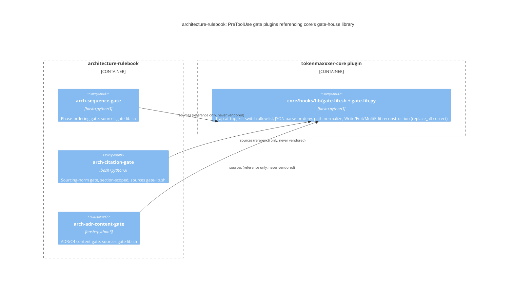

# Record: gate remediation toward fail-closed, allowlist-secure gates (issue #13)

## What was done

Migrated all three `PreToolUse` gates
(`arch-adr-content-gate/hooks/adr-content-gate.sh`,
`arch-citation-gate/hooks/citation-gate.sh`,
`arch-sequence-gate/hooks/sequence-gate.sh`) onto `tokenmaxxxer-core`
issue #72's landed `core/hooks/lib/gate-lib.sh`/`gate-lib.py` (referenced,
never vendored): trap-at-top fail-closed, allowlist kill-switches,
JSON parse-or-deny, absolute/relative path normalization, and
`replace_all`-correct `Write`/`Edit`/`MultiEdit` reconstruction.
Upgraded `arch-citation-gate`'s sourcing-norm check from whole-file
substring matching to section/adjacency scoping. Added a bounded
Bash-tool-write-bypass heuristic to `arch-sequence-gate`. Added 23 new
regression fixtures across the three plugins' `tests/fixtures/`
(10/10/13, full suite 33/33 fixtures) and reconciled `README.md`'s
Layout section with the landed state. See "Test matrix — landed state"
below for the executed `tests/run-gate-tests.sh` output.

## Why

Per `docs/issue-13/reports/architecture/survey.md` (Sources below), the
2026-08-01 code audit graded these three gates "B": trap-at-top absent
(uncaught errors fail open), kill switches backwards (an unrecognized
value silently disabled a gate), citation-gate's whole-file check both
false-positived on ordinary prose and let one URL anywhere exempt the
entire file. The approved proposal (Sources below) conditioned the
trap-at-top fix on core issue #72's shared gate-house library landing;
it landed (`tokenmaxxxer-core` commit `22a7cad`, Sources below) before
phase-2 kickoff, so this record delivers the full remediation — not the
deferred split the proposal's open question 3 anticipated — in one PR.

## Context

Issue #13's 2026-08-01 code audit graded this rulebook's three
`PreToolUse` gates (`arch-adr-content-gate`, `arch-citation-gate`,
`arch-sequence-gate`) "B" and named five defects, confirmed one-by-one in
the survey: (a) no trap-at-top; (b) a documented but unimplemented
`ARCHITECTURE_CYCLE_OFF` switch, plus a backwards denylist-shaped kill
switch on the three switches that do exist; (c) citation-gate's semantic
check was whole-file substring matching; (d) absolute-path
normalization, already correct — not a defect; (e) a `Bash`-tool write
bypass affecting all three gates, named as a related fail-closed gap
even though outside the original five points. At phase-2 kickoff, core
issue #72 was confirmed merged to `tokenmaxxxer-core`'s `main`,
unblocking the full remediation in one PR.

## Decision

Reference (never vendor) `core/hooks/lib/gate-lib.sh` +
`core/hooks/lib/gate-lib.py` from all three gates, following this
rulebook's existing sourcing idiom
(`architecture/hooks/directive.sh` -> `core/hooks/lib/role-directive.sh`).
Each gate now:

- Installs `gate_trap_fail_closed` as its first statement, before
  `set -uo pipefail` — any internal error now exits 2 (blocking) instead
  of a non-2 code Claude Code treats as non-blocking.
- Replaces its denylist kill-switch `case` with `gate_kill_switch_active`
  — only a recognized on-spelling (`1`/`true`/`yes`/`on`,
  case-insensitive) disables the gate; every other value, including an
  unrecognized one, leaves the gate active.
- Parses its JSON payload via `gate_lib.gate_parse_json_or_deny` and
  normalizes `file_path` via `gate_lib.gate_normalize_path` (root-relative
  tail, `None` on outside-root) instead of hand-rolled equivalents.
- Reconstructs `Write`/`Edit`/`MultiEdit` resulting content via
  `gate_lib.gate_reconstruct_write`, which honors a per-edit
  `"replace_all": true` (previously silently ignored — always
  first-occurrence-only regardless of the tool call's actual field).

`arch-citation-gate`'s semantic check moved from whole-file substring
matching to section/adjacency scoping: a trigger phrase and its
citation (URL or `Sources:` line) must fall in the same Markdown heading
block, or — for files with no heading structure — within a 15-line
window (the proposal's open question 2's fallback, confirmed usable as
implemented, not renegotiated). `arch-sequence-gate` additionally gained
a narrow, bounded Bash-write heuristic: a `Bash` command's `>`, `>>`, or
`tee` redirect target, once path-normalized, is treated as an
unresolvable write and denied if it lands inside a gated glob;
command substitution, `eval`, chained commands, heredocs, and
`python3 -c` writes are explicitly out of scope and deferred, per the
proposal's conservative-scope constraint.

`ARCHITECTURE_CYCLE_OFF` (proposal open question 1) is left unimplemented
by this record: the human approver did not resolve it in the Approve
comment, and it names a `SessionStart`-directive concept adjacent to, not
inside, the three audited `PreToolUse` gates — out of this remediation's
write scope.

## Consequences

- All five survey findings are now either fixed (a, b, c — modulo the
  Bash-write gap, e, which was also fixed) or confirmed already-correct
  (d, unchanged).
- A gate's own logic (ADR/C4 section checks, citation trigger phrases,
  phase-ordering rules) is unchanged in substance — only the
  cross-cutting fail-closed/kill-switch/reconstruction/path plumbing
  moved onto `gate-lib.sh`/`gate-lib.py` by reference.
- `README.md`'s Layout section now documents the gate-house standard
  adoption, the corrected kill-switch semantics, and points to the
  expanded fixture set (below) instead of describing a since-superseded
  denylist convention.
- The stray `ARCHITECTURE_CYCLE_OFF` documentation-only references
  remain unresolved — flagged again in Open findings rather than
  silently dropped.

## Alternatives considered

- **Reimplement a local trap-at-top helper instead of waiting on core
  issue #72.** Rejected in the phase-1 proposal and not revisited: issue
  #13 explicitly instructs referencing, not reimplementing, the shared
  gate-house library; #72 landed before phase-2 kickoff, so the
  alternative was never exercised.
- **Full general Bash-command parsing for the write-bypass fix.**
  Rejected as disproportionate scope per the approved proposal — a
  bounded literal-redirect heuristic covers the common case
  (`> path`, `>> path`, `tee path`) and explicitly defers command
  substitution/eval/chaining/heredocs/`python3 -c` rather than attempting
  a general shell parser inside a `PreToolUse` hook.
- **15-line adjacency fallback threshold for citation-gate's
  no-heading-structure case**, per the proposal's open question 2:
  implemented as recommended (15 lines) since the approver's Approve
  carried no adjustment.

## C4 diagram (container-level, illustrative)



## Test matrix — landed state

`bash tests/run-gate-tests.sh`, run against this branch with
`CLAUDE_PLUGIN_ROOT_CORE` pointed at a `tokenmaxxxer-core` checkout with
issue #72 landed: **33/33 fixtures PASS, exit 0.**

```
== arch-adr-content-gate == (10 fixtures)
PASS fail-absolute-path
PASS fail-malformed-json
PASS fail-missing-alternatives
PASS fail-multiedit-unresolvable
PASS pass-all-sections
PASS pass-kill-switch-recognized-off
PASS pass-kill-switch-unrecognized-value
PASS pass-multiedit-resolvable
PASS pass-plain-edit
PASS pass-replace-all
== arch-citation-gate == (10 fixtures)
PASS fail-absolute-path
PASS fail-malformed-json
PASS fail-section-scoped-far-citation
PASS fail-unsourced-claim
PASS pass-kill-switch-recognized-off
PASS pass-kill-switch-unrecognized-value
PASS pass-multiedit-resolvable
PASS pass-plain-edit
PASS pass-replace-all
PASS pass-sourced
== arch-sequence-gate == (13 fixtures)
PASS fail-absolute-path
PASS fail-bash-write-bypass
PASS fail-malformed-json
PASS fail-missing-scout-brief-no-skip-note
PASS fail-missing-survey
PASS pass-bash-unrelated-command
PASS pass-full-sequence
PASS pass-kill-switch-recognized-off
PASS pass-kill-switch-unrecognized-value
PASS pass-multiedit-resolvable
PASS pass-plain-edit
PASS pass-replace-all
PASS pass-scout-skip-justified
```

`fail-section-scoped-far-citation` is the key regression fixture for the
citation-gate semantic upgrade: a properly-cited section and a separate,
uncited trigger-phrase occurrence in an unrelated section of the same
file. Under the pre-fix whole-file-OR logic this would have wrongly
passed (one URL anywhere exempted the whole file); under the landed
section-scoped logic it correctly fails. `fail-bash-write-bypass` is the
key regression fixture for the Bash-write gap: a `Bash` redirect to a
gated path with no prerequisite survey present is now caught and denied,
where every gate previously passed any `Bash`-tool call through
unconditionally; `pass-bash-unrelated-command` proves the heuristic does
not false-positive on an unrelated path.

**Note on local test execution**: this repo does not vendor
`core/hooks/lib/gate-lib.sh`; running the suite locally requires either
`CLAUDE_PLUGIN_ROOT_CORE` pointed at an installed/checked-out `core`
plugin, or (as done for this record) a temporary, untracked symlink
`core -> <tokenmaxxxer-core checkout>/core` at the repo root, removed
before commit. In a real Claude Code plugin install, `core` is installed
alongside this rulebook and each gate's fallback path
(`hooks/../../core`) resolves the same way `architecture/hooks/
directive.sh` already relies on today.

## Open findings

- `ARCHITECTURE_CYCLE_OFF` (proposal open question 1) remains
  undecided: documented in `architecture/hooks/directive.sh` and a prior
  proposal, implemented nowhere, and this record does not resolve
  whether it should become a real `SessionStart`-scoped switch or have
  its stray references removed — it names a concept adjacent to, not
  inside, the three audited `PreToolUse` gates and so stayed outside this
  remediation's write scope. A future issue should settle it explicitly
  rather than leaving the documentation/implementation mismatch in place.
- The Bash-write-bypass heuristic (`arch-sequence-gate`) is intentionally
  bounded: command substitution, `eval`, `&&`/`;`-chained commands,
  heredocs, and `python3 -c` writes are not covered and remain a real,
  known gap, deferred (per the approved proposal) to whatever guidance
  core issue #72's gate-house standard eventually gives on a shared,
  more general Bash-write detector — not reimplemented three times
  locally in the meantime.

## Hand-off

No cross-role hand-off triggered — this remediation stayed entirely
inside the three `PreToolUse` gates and this role's own `README.md`/
`docs/issue-13/**`, per the proposal's write-set. `ARCHITECTURE_CYCLE_OFF`
remains an open, undecided loose end (see Decision section) for a future
issue if the human approver wants it resolved.

Sources:
- `docs/issue-13/reports/architecture/survey.md` (this repo — defect-by-defect current-state confirmation)
- `docs/issue-13/proposals/2026-08-01-gate-a-plus-remediation.md` (this repo — approved fix design)
- `tokenmaxxxer/tokenmaxxxer-core` commit `22a7cad` (`deliver(implementation): gate-house standard canonization (issue-72) (#74)`) — the landed `gate-lib.sh`/`gate-lib.py` this record builds on
- https://code.claude.com/docs/en/hooks (Claude Code hooks reference — exit-code semantics underlying the trap-at-top fix)

## 2026-08-01 addendum — compliance-check.sh confirmation

Following the human approver's `APPROVE issue-13/architecture` comment
on issue #13, this addendum records a run of `tokenmaxxxer-core`'s
gate-house standard compliance detector
(`core/hooks/tests/compliance-check.sh`, landed under core issue #72,
canon per its own header comment: "referenced (never vendored) exactly
like `stub-check.sh`") against each of this rulebook's three
`PreToolUse` gate hooks, per the issue's usage contract
(`compliance-check.sh <hooks-dir>`). The detector flags two hand-rolled
anti-patterns the gate-house standard supersedes: (1) a `*_OFF`
kill-switch env-var read with no `gate_kill_switch_active` call
(the confirmed fail-open case-statement bug), and (2) an
`Edit`/`MultiEdit` `.replace(x, y[, 1])` reconstruction with no
`gate_reconstruct_write` call (the confirmed `replace_all`-ignoring
bug) — both defects this record's "What was done" section above already
migrated onto `gate-lib.sh`/`gate-lib.py`.

Run date: 2026-08-01. Command and output:

```
$ bash <tokenmaxxxer-core checkout>/core/hooks/tests/compliance-check.sh arch-adr-content-gate/hooks
compliance-check: ok — arch-adr-content-gate/hooks/adr-content-gate.sh

$ bash <tokenmaxxxer-core checkout>/core/hooks/tests/compliance-check.sh arch-citation-gate/hooks
compliance-check: ok — arch-citation-gate/hooks/citation-gate.sh

$ bash <tokenmaxxxer-core checkout>/core/hooks/tests/compliance-check.sh arch-sequence-gate/hooks
compliance-check: ok — arch-sequence-gate/hooks/sequence-gate.sh

$ bash <tokenmaxxxer-core checkout>/core/hooks/tests/compliance-check.sh .
compliance-check: ok — arch-adr-content-gate/hooks/adr-content-gate.sh
compliance-check: ok — arch-citation-gate/hooks/citation-gate.sh
compliance-check: ok — arch-sequence-gate/hooks/sequence-gate.sh
$ echo $?
0
```

Result: **PASS, 3/3 gates "ok", exit 0** — no fixes were required. All
three gates already source `gate_kill_switch_active` and
`gate_reconstruct_write` from `gate-lib.sh`/`gate-lib.py` as landed by
this record's own "What was done" section, so the detector found no
hand-rolled kill-switch or reconstruction anti-patterns to flag. This
addendum confirms, via the independent core-canon detector rather than
this role's own test fixtures, that the gate-house standard migration
already delivered above holds under issue #72's own compliance tooling.

Addendum sources:
- `tokenmaxxxer/tokenmaxxxer-core`, `core/hooks/tests/compliance-check.sh` (gate-house standard compliance detector, issue #72 canon)
- issue #13 comment `APPROVE issue-13/architecture` (JiwonJung94, 2026-08-01T07:33:02Z) — the feedback this addendum executes against
