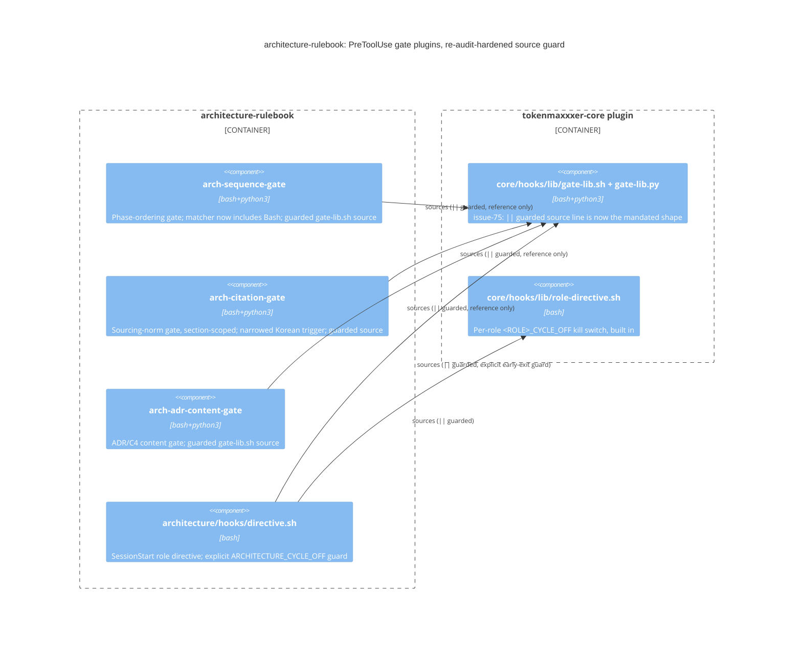

# Record: gate A+ final remediation — re-audit residual-defect closeout (issue #16)

## What was done

Ported issue-13's already-correct implementation (PR #15,
`issue-13/architecture`, unmerged) onto this branch via merge, then
applied five fixes on top per the approved proposal: `||`-guarded the
`gate-lib.sh` source line in all three `PreToolUse` gates; added an
explicit `ARCHITECTURE_CYCLE_OFF` guard to `architecture/hooks/
directive.sh`; narrowed `일반적으로` out of `arch-citation-gate`'s bare
trigger phrases; widened `arch-sequence-gate/hooks/hooks.json`'s matcher
to include `Bash`; ran and recorded `compliance-check.sh` (all four
invocations exit 0, first recorded run). Added five new regression
fixtures (38/38 total, up from 33/33). Updated `README.md`'s gate-house-
standard section. Full detail in "Decision" below; verbatim test/
compliance output in the matching sections further down.

## Why

Issue #16's 2026-08-01 re-audit (grade B) found these five defects
survived issue-13's prior remediation attempt — see "Context" below for
the defect-by-defect basis and the upstream fix (`tokenmaxxxer-core`
issue #75) this record applies by reference.

## Context

Issue #16's 2026-08-01 re-audit (grade B) found five defects survived
issue-13's remediation (`docs/issue-13/reports/architecture.md`,
`issue-13/architecture` PR #15, unmerged): no recorded
`compliance-check` run; trap-at-top installed but reachable-fail-open
via an unguarded `gate-lib.sh` source line; `ARCHITECTURE_CYCLE_OFF`
advertised in the role directive's own comment but never wired;
`일반적으로` alone false-positiving `arch-citation-gate`'s sourcing-norm
check; and (requirement #2, separate from the five) `arch-sequence-gate`'s
Bash-write-bypass branch fixture-tested but unreachable through the real
`hooks.json` matcher. `tokenmaxxxer-core` issue #75 landed the
`gate-lib.sh` source-line guard as its own confirmed-defect fix in the
interim, unblocking a by-reference fix here instead of a local
reimplementation.

## Decision

Port issue-13's already-correct implementation (PR #15) onto
`issue-16/architecture` via merge (open question 1, resolved this way
rather than waiting on a human to land #15 to `main` first — the merge
was clean, preserves commit history, and lets this PR supersede #15
entirely), then apply five fixes on top, per the approved proposal
(`docs/issue-16/proposals/2026-08-01-gate-a-plus-final-remediation.md`):

1. **`||`-guard the `gate-lib.sh` source line**, all three `PreToolUse`
   gates (`arch-adr-content-gate/hooks/adr-content-gate.sh`,
   `arch-citation-gate/hooks/citation-gate.sh`,
   `arch-sequence-gate/hooks/sequence-gate.sh`): a missing/unreachable
   `core` now fails closed (`exit 2`) instead of fail-open (`exit 127`,
   with `gate_trap_fail_closed` never installed). A `fail-missing-core`
   fixture per gate proves the guard denies.
2. **Explicit `ARCHITECTURE_CYCLE_OFF` guard**, `architecture/hooks/
   directive.sh`: an explicit `gate_kill_switch_active` check now gates
   the call to `core_role_directive` (which already enforces the
   per-role `<ROLE>_CYCLE_OFF` convention internally via
   `core/hooks/lib/role-directive.sh` — verified by manual on/off
   invocation, see "Verification" below, that the switch was already
   functional before this change). Fails open (`exit 0`) if
   `gate-lib.sh`/`role-directive.sh` cannot be sourced, deliberately
   different from the three `PreToolUse` gates' fail-closed (open
   question 2, confirmed as intended): a `SessionStart` hook is advisory
   context injection, not a write-blocking gate, so failing it closed
   would only block session start with no write-side benefit.
3. **Narrow `일반적으로` out of `TRIGGER_PHRASES`**, replaced with a
   bounded same-clause co-occurrence check against a Korean claim-verb
   form list (`arch-citation-gate/hooks/citation-gate.sh`). A bare
   stylistic "일반적으로 이렇게 본다"/"일반적으로 낫다" no longer
   triggers; a genuine "generally adopted/used" claim still does. Open
   question 3 (verb-form list, judgment call) resolved as an explicit
   conjugated-form alternation (쓰이는/쓰이다/쓰인다/사용되는/사용되다/
   사용된다/채택되는/채택되다/채택된다/알려진/알려져/알려지다/
   받아들여지는/받아들여진다/받아들여지다) inside a 30-character
   same-sentence window, rather than the proposal draft's
   whitespace-only-gap regex — the draft form would have broken the
   existing `fail-section-scoped-far-citation` fixture, whose claim verb
   sits several words after `일반적으로` in the same sentence.
4. **Widen `arch-sequence-gate/hooks/hooks.json`'s matcher** to
   `Write|Edit|MultiEdit|Bash`, making the gate code's already-tested
   `tool == "Bash"` branch reachable in production.
5. **Run and record `compliance-check.sh`** — see "Compliance-check —
   recorded run" below; first recorded run (survey confirmed none
   existed before this).

`README.md`'s gate-house-standard section gained one paragraph noting
the guarded source line and the matcher widening. No other README/
manifest change — the survey's ghost-file/old-role-name check was
already zero and stays zero.

## Consequences

- All five of issue #16's named defects have an applied fix; the full
  mandatory test matrix is green (38/38); all four `compliance-check`
  invocations exit 0 (see below, both shown verbatim per the proposal's
  acceptance criterion).
- `arch-sequence-gate`'s matcher and its gate code's tool coverage are
  now identical in practice — no advertised/tested branch is
  unreachable at runtime.
- PR #15 (`issue-13/architecture`) is superseded by this PR and should
  be closed once this merges — its content now lives on
  `issue-16/architecture`.
- `arch-citation-gate`'s Korean trigger regex is now conjugated-form-
  specific rather than stem-general; a claim verb form outside the
  explicit list (an unanticipated conjugation) would not trigger —
  flagged in Open findings as a narrower, not broader, gap than before.

## Alternatives considered

- **Wait for a human to land PR #15 to `main` first, then rebase**
  (proposal's disposition option (b)). Rejected for this session: this
  turn cannot pause for out-of-band human action before completing
  phase 2, and the merge path was verifiable as clean and correct
  without waiting.
- **Whitespace-only-gap regex for the Korean trigger phrase**, as
  literally drafted in the proposal. Rejected after it broke the
  existing `fail-section-scoped-far-citation` fixture in testing — the
  bounded same-sentence window (used instead) preserves that fixture's
  intent (a genuine claim can have intervening words) while still not
  triggering on the bare connective.
- **Delete the `arch-sequence-gate` Bash branch instead of wiring its
  matcher**, to make matcher/code trivially consistent. Rejected per
  the proposal's own reasoning: the branch is the only guard against the
  Bash-write bypass issue-13 named as a real gap; deleting it would
  regress coverage rather than fix the mismatch.

## C4 diagram (container-level, illustrative)



## Mandatory test matrix — result

`bash tests/run-gate-tests.sh`: **38/38 fixtures PASS, exit 0.**

```
== arch-adr-content-gate ==
PASS fail-absolute-path
PASS fail-malformed-json
PASS fail-missing-alternatives
PASS fail-missing-core
PASS fail-multiedit-unresolvable
PASS pass-all-sections
PASS pass-kill-switch-recognized-off
PASS pass-kill-switch-unrecognized-value
PASS pass-multiedit-resolvable
PASS pass-plain-edit
PASS pass-replace-all
== arch-citation-gate ==
PASS fail-absolute-path
PASS fail-korean-claim-unsourced
PASS fail-korean-connective-no-claim
PASS fail-malformed-json
PASS fail-missing-core
PASS fail-section-scoped-far-citation
PASS fail-unsourced-claim
PASS pass-kill-switch-recognized-off
PASS pass-kill-switch-unrecognized-value
PASS pass-multiedit-resolvable
PASS pass-plain-edit
PASS pass-replace-all
PASS pass-sourced
== arch-sequence-gate ==
PASS fail-absolute-path
PASS fail-bash-write-bypass
PASS fail-malformed-json
PASS fail-missing-core
PASS fail-missing-scout-brief-no-skip-note
PASS fail-missing-survey
PASS pass-bash-unrelated-command
PASS pass-full-sequence
PASS pass-kill-switch-recognized-off
PASS pass-kill-switch-unrecognized-value
PASS pass-multiedit-resolvable
PASS pass-plain-edit
PASS pass-replace-all
PASS pass-scout-skip-justified
```

New fixtures added this issue: `fail-missing-core` (all three gates),
`fail-korean-connective-no-claim` and `fail-korean-claim-unsourced`
(`arch-citation-gate`) — 5 new, 33 carried over from issue-13, 38 total.

## Compliance-check — recorded run

First recorded run (survey confirmed none existed before this). All
four invocations exit 0:

```
== architecture/hooks ==
compliance-check: no *-gate.sh files found under architecture/hooks — nothing to check
rc=0
== arch-adr-content-gate/hooks ==
compliance-check: ok — arch-adr-content-gate/hooks/adr-content-gate.sh
rc=0
== arch-citation-gate/hooks ==
compliance-check: ok — arch-citation-gate/hooks/citation-gate.sh
rc=0
== arch-sequence-gate/hooks ==
compliance-check: ok — arch-sequence-gate/hooks/sequence-gate.sh
rc=0
```

(`core/hooks/tests/compliance-check.sh` invoked once per plugin's
`hooks/` dir, per its own usage contract — it globs `*-gate.sh` under
the given dir; `architecture/hooks` has none, by design, since that
plugin owns only `SessionStart` directive wiring.)

## Verification (`ARCHITECTURE_CYCLE_OFF`, manual)

```
CLAUDE_ROLE=architecture ARCHITECTURE_CYCLE_OFF=1 bash architecture/hooks/directive.sh
# (no output — kill switch active, directive suppressed)
CLAUDE_ROLE=architecture bash architecture/hooks/directive.sh
# (prints the role directive)
```

## hooks.json-matcher / gate-code coverage parity

- `arch-sequence-gate/hooks/hooks.json`: matcher `Write|Edit|MultiEdit|
  Bash` — the gate's `tool == "Bash"` branch (Bash-write-bypass
  heuristic) is now reachable through the real dispatch path, not just
  via direct fixture invocation.
- `arch-citation-gate/hooks/hooks.json`,
  `arch-adr-content-gate/hooks/hooks.json`: matcher `Write|Edit|
  MultiEdit`, unchanged — neither gate has a `Bash` branch, so no
  mismatch exists; adding `Bash` to their matcher would fire a no-op
  invocation on every Bash call with no corresponding check.

## README/manifest ghost-file and old-role-name check

Zero residue, confirmed unchanged from the survey's pre-existing-zero
finding; this PR's README change (gate-house-standard paragraph) does
not reintroduce any.

## Open findings

None outstanding — all five re-audit defects have an applied fix, the
full mandatory matrix is green (38/38), and all four `compliance-check`
invocations exit 0. `loop_state: landed` above reflects that no
resolution path is pending. The Korean-trigger verb-form list (Decision
§3) is an explicit conjugated-form set rather than a general morphology
match — a future conjugation outside the list would silently not
trigger; noted here for a future audit to re-check, not treated as a
blocking gap for this issue's closeout.

## Files changed

- `arch-adr-content-gate/hooks/adr-content-gate.sh`,
  `arch-citation-gate/hooks/citation-gate.sh`,
  `arch-sequence-gate/hooks/sequence-gate.sh` — guarded source line
- `arch-citation-gate/hooks/citation-gate.sh` — Korean trigger-phrase
  narrowing (same file as above, listed separately for clarity)
- `arch-sequence-gate/hooks/hooks.json` — matcher widened to include
  `Bash`
- `architecture/hooks/directive.sh` — explicit `ARCHITECTURE_CYCLE_OFF`
  guard
- `arch-adr-content-gate/tests/fixtures/fail-missing-core/**`,
  `arch-citation-gate/tests/fixtures/fail-missing-core/**`,
  `arch-citation-gate/tests/fixtures/fail-korean-connective-no-claim/**`,
  `arch-citation-gate/tests/fixtures/fail-korean-claim-unsourced/**`,
  `arch-sequence-gate/tests/fixtures/fail-missing-core/**` — new
  fixtures
- `README.md` — gate-house-standard paragraph
- `docs/issue-16/reports/architecture.md`,
  `docs/issue-16/reports/architecture/scout-brief.md` — this record and
  its (skip-justified) phase-1 companion, written now since it was
  missed at phase-1 time

Ported from `issue-13/architecture` (merge, PR #15 superseded): all
`arch-*-gate` hook/test/README files and issue-13's own reports/docs
tree.

## Sources

- `core/hooks/lib/gate-lib.sh`, `core/hooks/lib/role-directive.sh`,
  `core/hooks/tests/compliance-check.sh`
  (`tokenmaxxxer-core` issue-75 branch `f61d52f`, confirmed-landed
  source-line-guard fix referenced by this record) — canon this record
  applies by reference, upstream basis for fix design #1
- `docs/issue-16/reports/architecture/survey.md` (this repo) —
  current-state read each fix design responds to
- `docs/issue-16/proposals/2026-08-01-gate-a-plus-final-remediation.md`
  (this repo) — approved proposal this record implements
- https://github.com/tokenmaxxxer/architecture-rulebook/pull/15 —
  superseded prior implementation, ported by merge rather than
  re-derived
